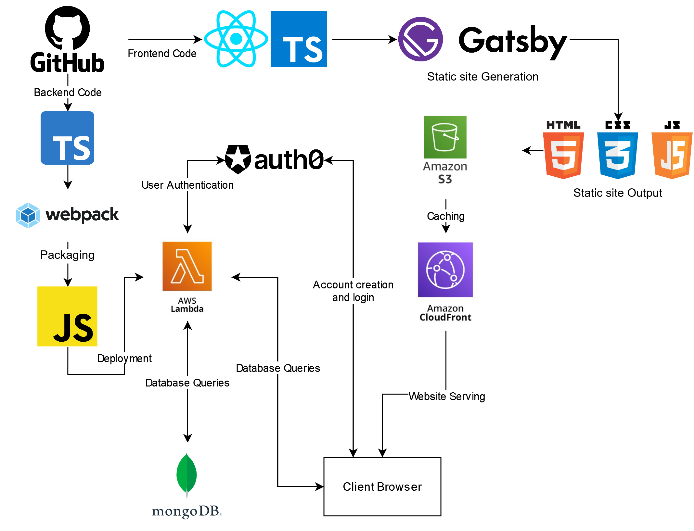

# meal-planner
A tool to help me plan meals.

The website is currently being deployed via AWS S3, CloudFront and Lambda.

A cached version using CloudFront can be found [here](https://dg2efxweu1ro6.cloudfront.net/).

An un-cached version (doesn't support https and will be slower but is up to date) can be found [here](http://drew-smith-meal-planner.s3-website-us-east-1.amazonaws.com/).

Here is a diagram of the webstack. (Mostly for me because this project got really complicated)

